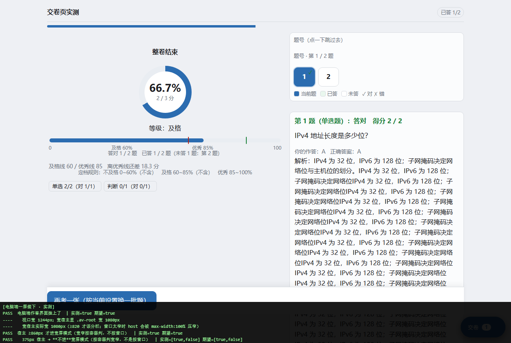

# review_quiz · 单文件离线刷题工具

**一个 HTML 文件就是全部**：导入 `docx` / `txt` 试题 → 自动切题校对 → 抽题作答判分 → 错题本 → 导出成一份能发给别人的离线单文件。
不装软件、不起服务、不注册账号；题库、进度、错题、API Key 只写**你自己浏览器**的 localStorage，断网可用（只有 AI 功能需要联网）。

> 由 **DeepSeek V4.1 Flash 生成**（人出需求、DS 写码）· 作者：李佳祎（北京理工大学）· MIT · <liyi07@outlook.com>



`review_quiz` is a single-file, offline, zero-dependency quiz/exam app for people who keep their question
banks as scattered Word/txt files and don't want a server or a cloud upload. Everything stays in your
browser's `localStorage`; only the optional AI features call the network, with **your own** API key.
*Generated with DeepSeek V4.1 Flash. MIT licensed.*

## 快速开始

1. **下载**：仓库右上 `Code` → `Download ZIP`，或者直接下载 [`review_quiz.html`](review_quiz.html)。
2. **打开**：电脑上双击即可（用浏览器打开）；手机上先存到手机，再从「文件管理」里选 Chrome / Edge 打开。
   > 微信 / QQ 里直接点常常打不开本地文件 —— 遇到打不开时页面会给出中文原因和「复制诊断信息」，把它发出去就能定位。
3. **进题库**：切到「导入 / 校对」页，把 `.docx` / `.txt` 拖进虚线框 → 逐题校对（列表默认只看"待校对"）→ 「确认入库」。
4. **开始刷题**：回「答题」页挑一套卷 → 「开始作答」（先出"答卷前设置"：抽题规则 / 题量 / 及格与优秀比例 / 判分）。
5. **发给别人**（可选）：「导出分享」选几套卷 → 打包成**一个**离线单文件 → 对方双击即答，不需要装任何东西。

不需要 Node、不需要 `npm install`、不需要服务器。只有 **AI 功能**（生成解析、整卷点评、举一反三）才需要你在
「导入 / 校对」页顶部填自己的 API Key（支持阿里百炼 DashScope 等可浏览器直连的服务商）。

## 功能

| | |
|---|---|
| **导入** | `.docx` / `.txt` / `.md` → 自动切成单选 / 多选 / 判断 / 简答，标出"待校对"，可逐题改 |
| **抽题** | 完全随机 · 全部作答 · 按题型数量 · 按题型总分；可设「未作答优先」 |
| **判分** | 多选半对给分（分值可调）· 简答按关键词命中率 · 判断题认 √×；及格线 / 优秀线按卷面比例 |
| **作答** | 答完自动判分、自动翻页（等待时间可调）· 答题计时悬浮球（可暂停）· 题号跳转 · 答题卡 |
| **错题本** | 交卷自动收录 · 按卷分组 · 跳回原卷 · 按考点「举一反三」出新题 |
| **分享** | 打包一个离线单文件，**只带试卷**（不含你的作答记录 / 成绩 / 错题 / 密钥） |
| **AI（可选）** | 生成解析 · 整卷总评 · 举一反三；调用你自己的服务商，结果先落"草案"，要你点「确认入库」 |

其他截图见 [`docs/`](docs)：导入页、抽取设置、错题本、手机端、导出分享、须知页等。

## 常见问题与已知限制

1. **导入识别不一定准**：题干里出现"答案"、选项不换行、简答没写关键词等都可能切错。（导入后逐题校对，切错的手动改。）
2. **判分口径有限**：简答只按关键词命中算分，**不理解语义**；多选默认"少选给 2 分、错选 0 分"。（口径可在设置里改，分数只作自查参考。）
3. **手机浏览器可能拦自动下载**：导出时自动下载被拦是常见的。（结果框里给了一条**真链接**，点它就存下来。）
4. **清缓存 = 掉数据**：localStorage 被清、换浏览器、隐私模式都会看不到旧记录。（重要题库请用「导出分享」留一份文件。）
5. **AI 会花钱也可能出错**：内容会发给你选的服务商。（不填 Key 也能用除 AI 外的全部功能。）
6. **大题库偏慢**：几万字的卷子在导入 / 校对时有可感知卡顿（纯前端单线程，无 Worker）。
7. **手机端排版是"能用"级**：窄屏会折叠、按钮都 ≥44px，但复杂卷子的阅读体验不如电脑端。

**安全性**：别人的题库 / 分享文件都只当**数据**处理（更详细的威胁模型与实测证据见 [`SECURITY.md`](SECURITY.md)）。
给超大输入设了上限：docx 单段解压 ≤ 64 MB、分享文件载荷 ≤ 32 MB，超了直接拒载并说明原因。

**设计取舍（不是 bug）**：没有服务器就没有同步 —— 换设备靠"导出一个文件"手动搬；本地存储有容量上限，超大题库建议分卷。

<details>
<summary>Known issues (EN)</summary>

- Import heuristics can mis-split unusual formats (proofread before committing).
- Short-answer grading is keyword-based (no semantics); multi-choice default: partial = 2 pts, any wrong = 0.
- Mobile browsers may block the automatic download (a real `<a download>` link is provided as fallback).
- Clearing browser storage loses all local data; use Export to keep a file copy.
- AI features need your own API key, send content to your chosen provider, and can be wrong.
- Large banks are slow to import (single-threaded, no workers); the mobile layout is functional, not ideal.

</details>

## 开发

零依赖，只要 Node（≥18）。`review_quiz.html` 是**产物**，由模板 + `core/` + `ui/` 内联生成：

```bash
node build.js            # 生成 review_quiz.html（同时同步一份到桌面）；构建内含语法 / 内联顺序 / 占位符自检
node verify/run-all.js   # 全量回归：解析、判分、抽题、流程、存储、导出、错题本…跑完打一份汇总
node test.js && node verify.js
```

`verify/` 下除单元测试外，还有一批 **真浏览器取证脚本**（`*-gen.js` 生成一个注入测量脚本的页面，
用 headless Edge 打开后 `*-parse.js` 读数）：导入→入库→答题端到端、导出分享、手机端布局、
自动翻页、导出文件在其它浏览器里能否打开、**恶意题库的注入链**…… 这些不是"跑一遍就算过"，
而是把**人眼能核对的数字**打出来。安全相关的断言单独放在 `verify/safety.test.js` +
`verify/inject-*.js`（威胁模型见 [`SECURITY.md`](SECURITY.md)）。

代码里所有"为什么这么写"都写在注释与 `CONTRACT.md` 里；`docs/verification-log.md` 是开发过程的逐轮验收日志（中文，可选读）。

<details>
<summary>目录结构</summary>

```
review_quiz.html       ← 交付物：单文件成品（双击即用）
build.js               ← 构建：模板 + core/ + ui/ → 上面的成品
core/  ui/  parser-core.js   ← 源码（UMD：浏览器与 Node 双跑）
*-template.html        ← 页面模板（含 __X_CORE__ 内联占位符）
verify/                ← 测试与真浏览器取证脚本（run-all.js 是全量入口）
docs/                  ← 截图
CONTRACT.md            ← 设计契约：字段白名单、命名空间、配置模型、行为不变量
fixtures/ sample.docx  ← 解析器测试固件
tools/make_sample.py   ← 生成测试用样卷
```
其它成品页（`答题页.html` / `错题本.html` / `校对面板.html` / `浏览器自检.html` / `解析器Demo.html`）
由 `node build.js` 一并生成，属于开发期产物，未入库。

</details>

## License

MIT，见 [`LICENSE`](LICENSE)。

## Credits

- **作者**：李佳祎（北京理工大学 · 2625）· <liyi07@outlook.com>
- **生成方式**：代码、文档与验证脚本由 **DeepSeek V4.1 Flash** 生成 —— 人负责定需求与验收，
  模型负责实现，并把"怎么证明它是对的"一起写进仓库（`CONTRACT.md` + `verify/`）。
- 仓库：<https://github.com/kokuraasahidesu/review_quiz>
